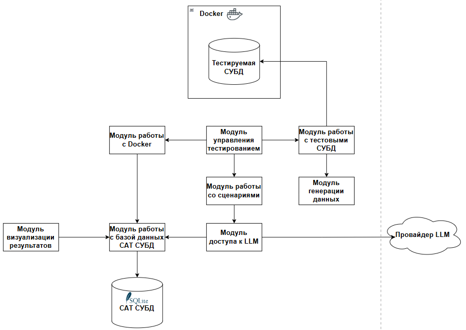

# DB Test System
DB Test System — настольное и CLI-приложение для нагрузочного тестирования любой реляционной СУБД. Проект позволяет в несколько кликов настроить контейнер с базой, описать сценарий (SQL-команды с параметрами нагрузки) и получить визуальный отчёт с метриками производительности.

## 🚀 Основные возможности

| Возможность               | Краткое описание                                                                                 |
|---------------------------|--------------------------------------------------------------------------------------------------|
| **Единый DSL сценариев**  | Шаги `CreateTable → InsertData → Query` в JSON/YAML с визуальным редактором и CLI                |
| **Расширяемые адаптеры**  | Реляционные (`SQLAdapter`), key-value (`RedisAdapter`, `EtcdAdapter`) и пользовательские плагины |
| **Автогенерация схем**    | LLM-модуль (ChatGPT-4-turbo / YaGPT 2) синтезирует DDL и тест-данные по SQL-запросу              |
| **Контейнерная изоляция** | Базы данных поднимаются, мониторятся и очищаются через Docker                                    |
| **Real-time метрики**     | Встроенная панель  CPU / IO и логи генератора                                                    |
| **GUI**                   | Десктопный клиентский интерфейс                                                                  |


## 🏛️ Архитектура



## 🔌 Адаптеры

Перечень адаптеров для проведения тестирования СУБД поддерживаемых "из коробки"

| Адаптер          | Поддерживаемые СУБД                                               | Особенности                                                      |
|------------------|-------------------------------------------------------------------|------------------------------------------------------------------|
| **SQLAdapter**   | PostgreSQL • MySQL • SQLite • MS SQL • Oracle • Starrocks и т. д. | Использует диалекты SQLAlchemy                                   |
| **RedisAdapter** | Redis                                                             | Хранение строк в `HSET`, поддержка CLI-запросов                  |
| **EtcdAdapter**  | etcd                                                              | gRPC-протокол, хранение записей в JSON                           |
| **Custom**       | любая                                                             | Реализуйте интерфейс `BaseAdapter` (`connect`, `insert_data`, …) |

📈 Метрики
* CPU
* RAM
* I/O-wait 
* Time

# Быстрый старт
## Пример конфига для тестирования Postgres

```
postgres: {
         "db_type": "postgresql",
         "default_user": "postgres",
         "default_password": "password",
         "default_port": 5432,
         "default_db": "test_db",
         # Зависит от того, как у вас в Dockerfile/образе обозначены переменные
         "env": {
             "POSTGRES_USER": "postgres",
             "POSTGRES_PASSWORD": "password",
             "POSTGRES_DB": "test_db",
         },
     }
```

# UI


# Лицензия

Проект распространяется под лицензией Apache 2.0 — см. [LICENSE]() для деталей.

