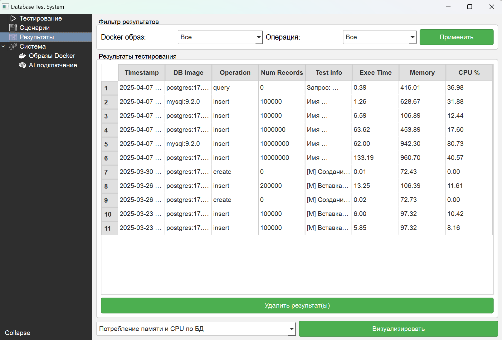
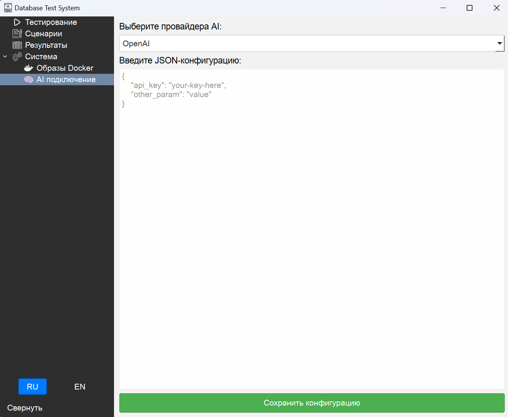

# DB Test System
DB Test System — настольное и CLI-приложение для нагрузочного тестирования любой реляционной СУБД. Проект позволяет в несколько кликов настроить контейнер с базой, описать сценарий (SQL-команды с параметрами нагрузки) и получить визуальный отчёт с метриками производительности.

## Возможности

* Cоздание сценариев через UI — укажите SQL-запросы, интенсивность, длительность и кол-во потоков.
* Поддержка нескольких СУБД — PostgreSQL, MySQL/MariaDB, SQLite, MSSQL и др. через SQLAlchemy-dialects.
* Контейнеры Docker прямо из приложения — поднимаем нужный образ одним кликом (скрин «docker_images.png»).
* Тесты длительного прогона — выдерживает часы нагрузки; результаты пишутся в SQLite и экспортируются в CSV/Excel.
* AI-помощник — генерирует схему данных на основании запроса.
* Отчёты с графиками — TPS, latency percentiles.

# Быстрый старт
## Пример конфига для тестирования Postgres

```
postgres: {
         "db_type": "postgresql",
         "default_user": "postgres",
         "default_password": "password",
         "default_port": 5432,
         "default_db": "test_db",
         # Зависит от того, как у вас в Dockerfile/образе обозначены переменные
         "env": {
             "POSTGRES_USER": "postgres",
             "POSTGRES_PASSWORD": "password",
             "POSTGRES_DB": "test_db",
         },
     }
```

# UI





# Лицензия

Проект распространяется под лицензией Apache 2.0 — см. [LICENSE]() для деталей.

