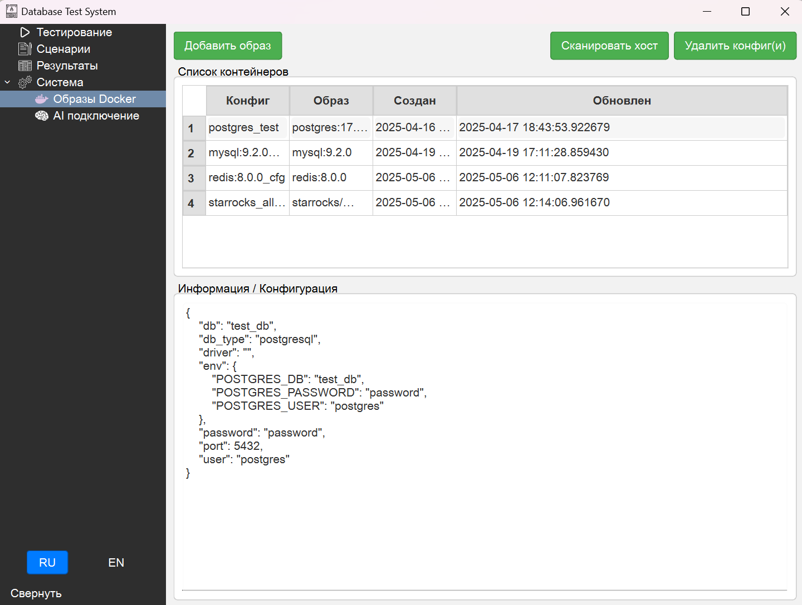

# db_test_system
Allow make load tests for any DB


# Quiq start
## Config image connection

```
postgres: {
         "db_type": "postgresql",
         "default_user": "postgres",
         "default_password": "password",
         "default_port": 5432,
         "default_db": "test_db",
         # Зависит от того, как у вас в Dockerfile/образе обозначены переменные
         "env": {
             "POSTGRES_USER": "postgres",
             "POSTGRES_PASSWORD": "password",
             "POSTGRES_DB": "test_db",
         },
     }
```

# UI



